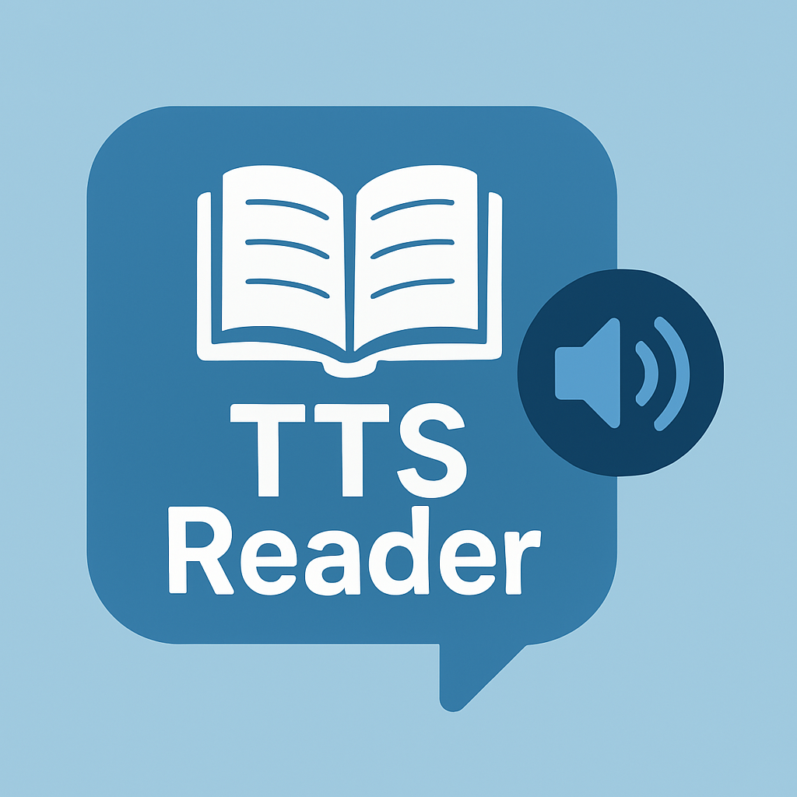

# Right-Click TTS Reader

A simple Chrome extension that reads selected text aloud using Text-to-Speech.

## ⚠️ Disclaimer

**This extension is intended for personal use only.**

This is an experimental project that may contain bugs or limitations. It is not guaranteed to work perfectly across all websites or with all types of text content. Use at your own risk and discretion. The developer is not responsible for any issues that may arise from using this extension.

## Features

- 🔊 Read selected text with a right-click context menu
- 🎙️ Choose from available system voices (default: Google UK English Male)
- ⏱️ Adjust reading speed to your preference
- 📊 View reading progress with a progress bar
- 📃 Handles long texts by automatically splitting into chunks

## Installation

### Manual Installation (Developer Mode)
1. Download or clone this repository
2. Open Chrome and navigate to `chrome://extensions/`
3. Enable "Developer mode" (toggle in the top-right corner)
4. Click "Load unpacked" and select the extension folder
5. The extension is now installed and ready to use

## How to Use

1. Select any text on a webpage
2. Right-click and choose "🔊 Read Selected Text"
3. The extension popup will open with the selected text
4. Choose your preferred voice and speed
5. Click "Play" to start reading, or "Stop" to cancel

## Known Issues

- Voice selection may vary depending on what voices are installed on your system
- Very long texts may not load properly
- Some websites with complex text formatting may not work as expected
- The extension may not work on certain restricted websites

## Files

- `manifest.json` - Extension configuration
- `background.js` - Background service worker that manages the extension state
- `popup.html` - HTML for the extension popup
- `popup.js` - JavaScript for the popup functionality
- `popup.css` - Styling for the popup
- `icon.png` - Extension icon

## Technical Details

- Uses the Web Speech API for text-to-speech functionality
- Implements a background service worker for extension lifecycle management
- Handles context menu integration for easy access
- Stores user preferences using Chrome's storage API
- Manages speech state across popup sessions

## Permissions

- `contextMenus` - For the right-click menu option
- `storage` - To save user preferences
- `activeTab` - To access the currently active tab

## Browser Compatibility

- Chrome 88+
- Edge 88+ (Chromium-based)
- Opera 74+
- Brave, Vivaldi, and other Chromium-based browsers

## License

MIT License - Feel free to use, modify, and distribute as you like.

## Privacy

This extension does not collect or send any user data. All selected text and settings are stored locally on your device and are not transmitted to any external servers.

---

Made for personal use. This is not a commercial product.
